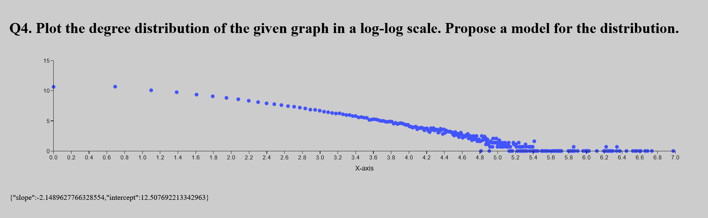

# Answers to questions

[Github Repository Link](https://github.com/EvanPartidas/HSE_Applied_Graph_Theory_2025_Homework8/tree/main)

## Q1. Compute the mean and the deviation of the degree distribution of the graph whose edges are in the attached file

Generated by [src/graph/question1.ts](https://github.com/EvanPartidas/HSE_Applied_Graph_Theory_2025_Homework8/blob/main/src/graph/question1.ts)

```
Mean Degree: 6.336385010715549

Standard Deviation of Degree: 14.139971341156617
```

## Q2. What should be p equal to in order to have a G(n,p) with as many edges (hence the same average degree)?

p = (2 _ edges) / (nodes _ (nodes - 1))

p = 0.000033

## Q3. Compare the standard deviation of the given graph and a G(n,p) with the p obtained in the previous question. What does it means?

Generated by [src/graph/question3.ts](https://github.com/EvanPartidas/HSE_Applied_Graph_Theory_2025_Homework8/blob/main/src/graph/question3.ts)

```
Generating Erdős-Rényi graph with 10000 nodes and edge probability 0.0006337018712586808

Graph generation complete.

Generated graph with 10000 nodes and edge probability 0.0006337018712586808

Mean Degree: 6.3756

Standard Deviation of Degree: 2.5350196527837925
```

The standard deviation varies greatly from the original input graph, meaning that the original graph is not a "random" graph.

## Q4. Plot the degree distribution of the given graph in a log-log scale. Propose a model for the distribution.

The code for this is in [src/App.tsx](https://github.com/EvanPartidas/HSE_Applied_Graph_Theory_2025_Homework8/blob/main/src/App.tsx)

A line that fits would be {"slope":-2.1489627766328554,"intercept":12.507692213342963}


## Q5. Compute the (theoretical) mean and deviation of a power law. How large can be the standard deviation? What does it means?

Mean = k_min\*(alpha - 1)/(alpha-2)

Mean = 7.71308646766617

Standard deviation: The variance (and thus SD) exists only if alpha>3

If 2 < alpha <= 3,the mean is finite but the SD is infinite.

Infinite SD means the distribution is dominated by rare, extremely large values, this means heavy-tailed behavior with huge hubs in the graph.

## Q6. Write a function which generate a random simple graph with exactly the same degree sequence as the given graph. Write the edges in a file edgelist2.txt (with the same format as edgelist.txt) and send it with your homework.

Source code: [src/graph/question6.ts](https://github.com/EvanPartidas/HSE_Applied_Graph_Theory_2025_Homework8/blob/main/src/graph/question6.ts)

But here's the function that does most of the heavy lifting for question 6: [function link](https://github.com/EvanPartidas/HSE_Applied_Graph_Theory_2025_Homework8/blob/main/src/graph/analysis.ts#L67)

File: [edgelist2.txt](https://github.com/EvanPartidas/HSE_Applied_Graph_Theory_2025_Homework8/blob/main/edgelist2.txt)
